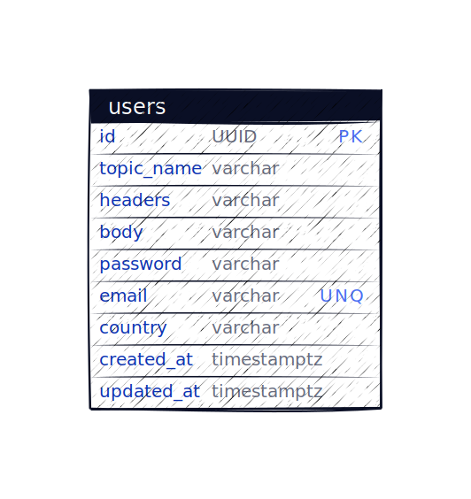
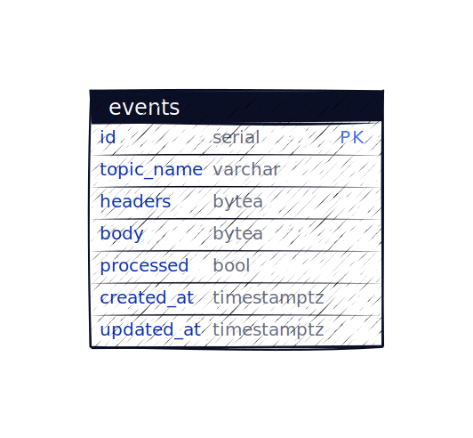

# User Service
This service is responsible for managing users.
 
 

It is a gRPC service that implements the following:

```protobuf
// Service responsible for maintaining users.
service UserService{
    // Gets a user.
    rpc GetUser(GetUserRequest) returns (GetUserResponse);
    // Lists a set of users.
    rpc ListUsers(ListUsersRequest) returns (ListUsersResponse);
    // Creates a user.
    rpc CreateUser(CreateUserRequest) returns (CreateUserResponse);
    // Updates a user.
    rpc UpdateUser(UpdateUserRequest) returns (UpdateUserResponse);
    // Deletes a user.
    rpc DeleteUser(DeleteUserRequest) returns (DeleteUserResponse);
}
```

When an entity is modified/created,  an event is emitted to Kafka. This is to enable
services to be able to consume and react.  

The current topics implemented are:
* `user-created_v1`
* `user-updated_v1`
* `user-deleted_v1`

Each event contains the resource that was affected, encouraging consumers to not need to call back to this service
(**Event notification pattern**). 

Full Schema documentation is available in the `/proto folder`.

## Testing
In order to test the API directly you can use a tool like [Kreya](https://kreya.app/)
this allows the ability to import the `/proto` package and execute requests.

## Kafka Debugging
To view Kafka messages you can use a tool like Kafkacat/Kcat. Install the [tool](https://github.com/edenhill/kcat).
Then ensure that everything is running via Docker and execute: 

```shell
kcat -b localhost:29092 -t ${TOPIC_NAME}
```

## Health Checks
For health checks I chose to utilise the Hello Fresh [health-check library](http://github.com/hellofresh/health-go/v5)
The checks are accessible on the `/health-check` endpoint.

* `/health-check/liveness` - Denotes whether the service is live
* `/health-check/readiness` - Denotes whether the service is ready to serve traffic 
  * Currently only have Postgres DB periodic checks. Not able to get Kafka at this point. 

## Metrics
The service has been setup using Prometheus to expose metrics. Currently, its attached to the GRPC server using promgrpc. 
This collects metrics such as:
* Counters:
  * Number of requests per method (`grpc_server_handled_total`)
* Histogram:
  * Request latencies

To calculate the average request duration during the last 5 minutes from a histogram or summary you can use the following
PromQL:

```
rate(grpc_server_handling_seconds_sum[5m])
/ 
rate(grpc_server_handling_seconds_count[5m])
```

The full list of available metrics can be found [here](https://github.com/grpc-ecosystem/go-grpc-prometheus). 


## Repository
The repository follows a monorepo style approach.
It is structured as follows:

* `/github` - github setup/github actions
* `/build` - generated files such as protobuf definitions
* `/docs` - repo related docs containing data model
* `/pkg` - shared libraries for project
* `/proto` - global protobuf definitions
* `/cmd` - containing the service executables
* `/internal` - internal Go implementation


### Makefile
* `make lint` - run linter across project
* `make proto-generate`-protobuf generation
* `make build` - build containers
* `make run` - to run services
* `make test` - executes tests
* `make test-integration` - executes integration tests (requires DB & Kafka to be up)

### Protobuf
In order to generate definitions run `make proto-generate`. This will
generate code for languages specified in `buf.gen.yaml` based on
proto definitions in `/proto`. For extra language support
add in `buf.gen.yaml`


## Improvements 
* **Production Readiness**
  * In order to scale services accordingly Kubernetes could be used for each service
    so that they can be scaled independently and horizontally.
* **API**
  * Currently, the API validations are quite verbose `Key: 'User.Email' Error:Field validation for 'Email' failed on the 'email' tag`.
  This could be improved by customising the validator.
  * Perform extra checks such as pagination params being too high
  * Currently, filters are not being validated.
  * Additionally, with pagination I chose offset/limit. However, using something like Cursor based pagination could be
  more efficient, but just adds further complexities to implement.
* **Scale**
  * Depending on scale this service could be separated. A pattern such as CQRS could be implemented to separate the write
   and read functionality.
* **Health Checks**
  * I tried looking into Kafka health checks with Sarama but couldn't find anything exposed to denote things are unhealthy.
It would look something like:
```go
health.Config{
  Name:      "kafka",
  Timeout:   time.Second * 2,
  SkipOnErr: false,
  Check: func(ctx context.Context) error {
      return kafkaClient.Ping()
  },
},
```

* **Data Model**
  * For brevity, I made all fields required. Potentially only email, firstname, and last name could be required on creation.
  * Password based on the requirements is in plaintext. I would generally avoid this, use a tool like Bcrypt and store the hash and salt.
  * `CountryCode` - could use an enumeration for this to be stricter on input/filtering.
* **Metrics**
    * Further custom metrics could be added for business logic. 
    * Grafana setup so that custom dashboards can be defined. 
* **Testing**
  * Improve service layer tests, ran out of time to cover further edge cases.
  * I've spent a lot of time recently using Testcontainers. I feel it'd be much better to use than `docker-compose.yml` as you get more control in tests. 
  * e2e tests
    * I would like to write e2e tests to spin up the service and call each endpoint validating that they work. This would be done by spinning up via docker-compose and writing BDD styled tests. The Ginkgo library is good for this.

**Messaging Guarantees**

To provide at least-once message publishing guarantees I would most likely follow a Transactional Outbox pattern.
The service would have an events table and whenever it performs a modifying operation
it would write to the table. This would ensure that given every change to an entity, a following event
is published.

I would have a central running alongside the service which would pickup 
any unprocessed events.


See below for SQL and design:
```sql
select * from events where processed=false;
```


Alternatively, to avoid engineering overhead/re-usability a tool such as Debezium could be used
which would monitor Database changes and fire Change-Data-Capture (CDC) events.
