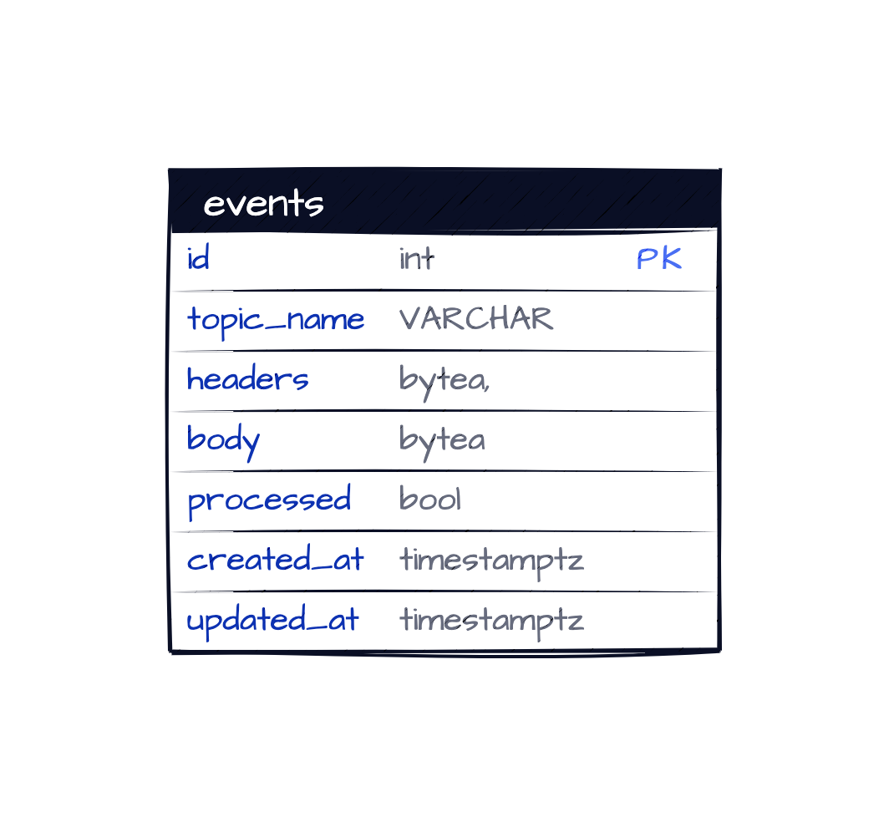

# User Service

To view Kafka messages you can use a tool like Kafkacat/Kcat. Install the [tool](https://github.com/edenhill/kcat)
ensure the service is running and then execute 

```shell
kcat -b localhost:29092 -t ${TOPIC_NAME}
```

## Repository
The repository follows a monorepo style approach.
It is structured as follows:

* `/github` - github setup/github actions
* `/build` - generated files such as protobuf definitions
* `/docs` - repo related docs containing data model & sequence diagrams.
* `/pkg` - shared libraries for project
* `/proto` - global protobuf definitions
* `/services` - containing any microservices

### Services
All services in `/service` directory should be containerised using Docker.
In order to spin up infrastructure run `make run`.

### Makefile
* `make lint` - run linter across project
* `make proto-generate`-protobuf generation
* `make build` - build containers
* `make run` - to run services
* `make test` - executes tests
* `make test-integration` - executes integration tests

### Protobuf
In order to generate definitions run `make proto-generate`. This will
generate code for languages specified in `buf.gen.yaml` based on
proto definitions in `/proto`. For extra language support
add in `buf.gen.yaml`


## Improvements 
* Depending on scale (CQRS)...
* Health Checks
  * I tried looking into Kafka health checks with Sarama but couldn't find anything exposed to denote things are unhealthy.
It would look something like:
```go
health.Config{
			Name:      "kafka",
			Timeout:   time.Second * 2,
			SkipOnErr: false,
			Check: func(ctx context.Context) error {
				return kafkaClient.Ping()
			},
		},
```

* Data Model
  * For brevity, I made all fields required. Potentially only email, firstname, and last name could be required on creation.
  * Password based on the requirements is in plaintext. I would generally avoid this, use a tool like Bcrypt and store the hash and salt.
* Metrics
    * To add metrics I would look at adding [promhttp](https://github.com/prometheus/client_golang/tree/master/prometheus/promhttp) to be able to instrument the HTTP handler. This would enable
      dashboards to be built to track things like latency and number of requests
* Testing
  * Improve service layer tests, ran out of time to cover further edge cases
  * e2e tests
    * I would like to write e2e tests to spin up the gateway and call each endpoint validating that they work. This would be done by spinning up via docker-compose and writing BDD styled tests. The Ginkgo library is good for this.
* Production Readiness
  * All committed secrets, setup should be removed and injected in as a separate process.
  * In order to scale services accordingly Kubernetes could be used for each service
    so that they can be scaled independently and horizontally.
  * Monitors setup to track service health such as `/health`, `/metrics` endpoint as well
    as business metrics where alerts can be triggered.

To provide at least-once message publishing guarantees I would most likely follow a Transactional Outbox pattern.
The service would have an events table and whenever it performs a modifying operation
it would write to the table. This would ensure that given every change to an entity, a following event
is published.

I would have a central running alongside the service which would pickup 
any unprocessed events.

See below for SQL and design:
```sql
select * from events where processed=false;
```


Alternatively, to avoid engineering overhead a tool such as Debezium could be used
which would monitor Database changes and fire Change-Data-Capture (CDC) events.


Key: 'User.Email' Error:Field validation for 'Email' failed on the 'email' tag

Filter validation

Delete is a hard delete, could do soft delete instead. 